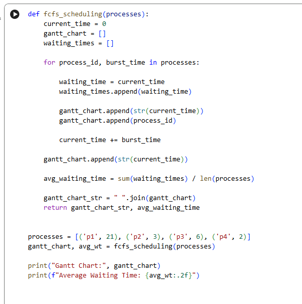

<div align="center">

# 🚀 FCFS CPU Scheduling Simulator

### First Come First Serve (FCFS) Scheduling Algorithm in Python

[](https://www.python.org/)
[](LICENSE)
[](https://colab.research.google.com/github/tausif112/FCFS-CPU-Scheduling-Simulator/blob/main/FCFS.ipynb)

</div>

---

## 📌 Overview

A Python-based implementation of the **First Come First Serve (FCFS)** CPU Scheduling Algorithm. The project calculates process waiting times, average waiting time, and generates a simple Gantt Chart representation.

Developed and tested using **Google Colaboratory (Google Colab)**.

---

## ✨ Features

* FCFS Scheduling Simulation
* Waiting Time Calculation
* Average Waiting Time Calculation
* Gantt Chart Generation
* Google Colab Notebook Included

---

## 🧠 About FCFS

FCFS (First Come First Serve) is a non-preemptive CPU scheduling algorithm where the process that arrives first gets executed first.

### Advantages

* Easy to implement
* Fair process ordering
* Low scheduling overhead

### Limitations

* High waiting time for short processes
* Convoy Effect
* Inefficient for interactive systems

---

## ⚙️ Algorithm

1. Start with current time = 0
2. Execute processes sequentially
3. Calculate waiting times
4. Update execution timeline
5. Generate Gantt Chart
6. Compute average waiting time

---

## 🧮 Input

```python
processes = [
    ('P1', 21),
    ('P2', 3),
    ('P3', 6),
    ('P4', 2)
]
```

## 📊 Output

```text
Gantt Chart: 0 P1 21 P2 24 P3 30 P4 32

Average Waiting Time: 18.75
```

---

## 📸 Google Colab Workspace



---

## 📈 Program Output


---

## 📂 Project Structure

```text
FCFS-CPU-Scheduling-Simulator/
│
├── FCFS.ipynb
├── fcfs.py
├── README.md
├── LICENSE
├── .gitignore
│
└── screenshots/
    ├── colab-workspace.png
    └── output.png
```

---

## 🚀 Run Locally

```bash
git clone https://github.com/tausif112/FCFS-CPU-Scheduling-Simulator.git

cd FCFS-CPU-Scheduling-Simulator

python fcfs.py
```

---

## 🛠 Technologies Used

| Technology        | Purpose                 |
| ----------------- | ----------------------- |
| Python            | Core Implementation     |
| Google Colab      | Development Environment |
| GitHub            | Version Control         |
| Operating Systems | Scheduling Concepts     |

---

## 🔮 Future Improvements

* Arrival Time Support
* Turnaround Time Calculation
* Response Time Calculation
* Shortest Job First (SJF)
* Round Robin Scheduling
* Graphical Gantt Chart Visualization

---

## 👨‍💻 Author

### Md Tausif Uddin

Department of Computer Science & Engineering (CSE)  
University of Asia Pacific (UAP)

GitHub: https://github.com/tausif112


⭐ If you found this project useful, consider giving it a star.
